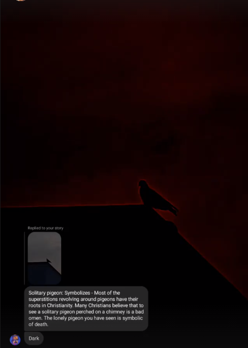

# Day-11 Summary:

BAD OMEN!
### Things Done:
Only got one hour of coding time today.
Solved first five question of [this](https://github.com/kunal-kushwaha/DSA-Bootcamp-Java/blob/main/assignments/05-arrays.md).
Uploaded the code [here](/Code/Day11/).

### Extra's:

Just a random brainfood for you :).
